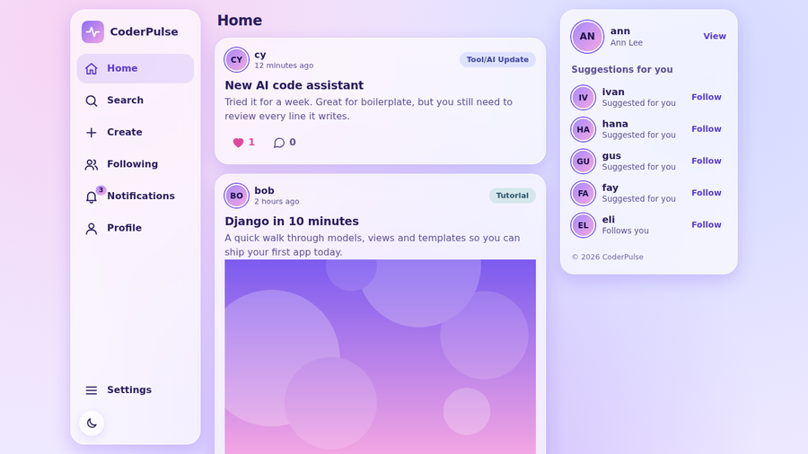
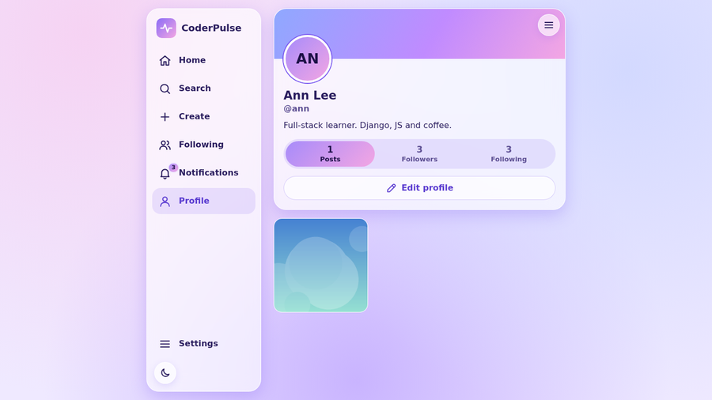
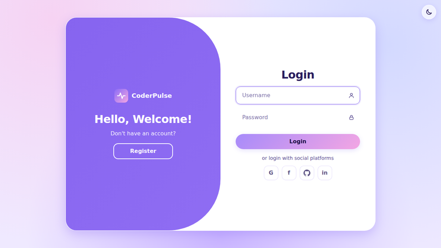
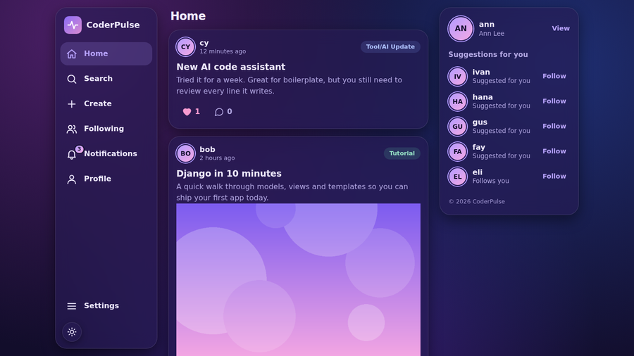
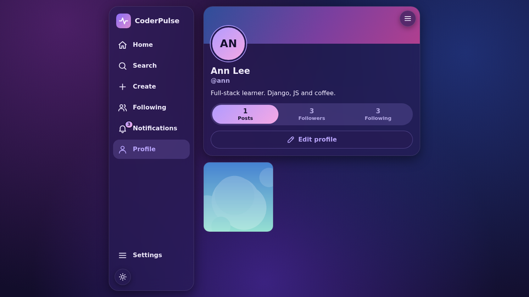
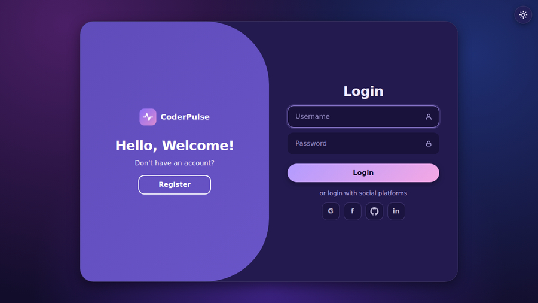

# CoderPulse

A small social network for developers, built with Django, SQLite and plain HTML, CSS and JavaScript.
CodeAlpha Full Stack Development, Task 2.

## Features
- Sign up, log in and log out on one sliding card
- Profiles with bio and avatar, followers and following lists
- Posts with a category and optional image, comments, likes
- Home, Following and Followers feeds, plus search
- Notifications for likes, comments and new followers
- Dark mode, laptop sidebar layout and phone bottom-bar layout

## Screenshots

| Home | Profile | Login |
|---|---|---|
|  |  |  |
|  |  |  |

More phone and laptop views are in `screenshots/`.

## Run locally

Python 3.10+.

```bash
python -m venv venv
venv\Scripts\activate          # macOS/Linux: source venv/bin/activate
pip install -r requirements.txt
set DJANGO_DEBUG=1             # macOS/Linux: export DJANGO_DEBUG=1
python manage.py migrate
python manage.py runserver
```

Open http://127.0.0.1:8000/ and sign up.
Tests: `python manage.py test --settings=config.settings_test`

## Deploy

Works on any host that runs a Python web process (Render, Railway, Heroku, a VPS).


## Structure

```
accounts/        users, profiles, follows
posts/           posts, comments, likes, search
notifications/   bell and notifications page
config/          settings, urls
templates/ static/
```

Like and follow buttons POST from `static/js/app.js`; the view adds the row or removes it if it exists. `notify()` in `notifications/models.py` creates notifications, and unliking or unfollowing removes them.
